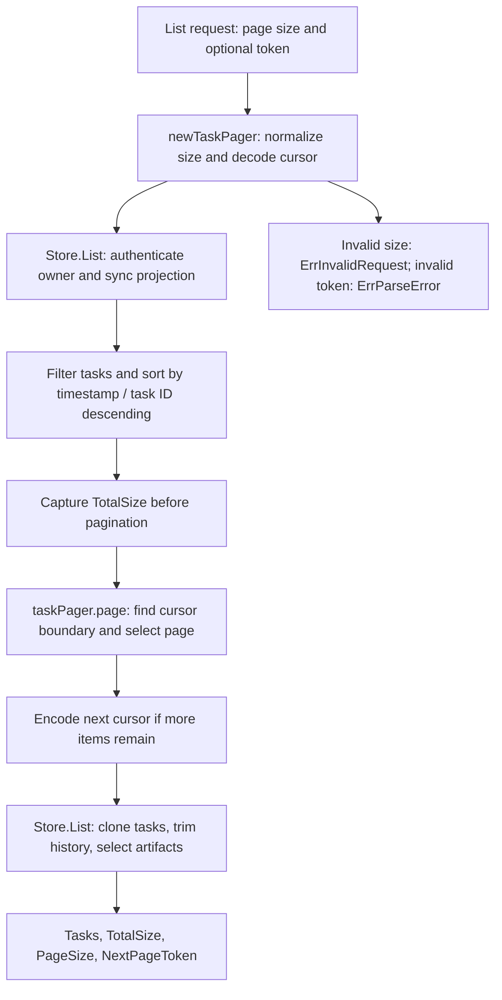

# A2A List Pager Review Design

Status: historical design; the `pkg/tape/a2a` implementation has been removed
from tape-go. The specification and diagram below describe its former pager.

## Design diagram

The pager receives already filtered and sorted items. Authentication and task
response shaping remain responsibilities of `Store.List`.

## Context

PR #2 raised two review threads in the former `pkg/tape/a2a/list.go`: the List path should use a direct page-size check instead of the generic validator helper, and cursor pagination should move out of `Store.List` into a Pager abstraction.

## Decision

Keep `github.com/go-playground/validator/v10` for Config, record, and protocol-structure validation, but remove it from the simple List page-size check. A package-private `taskPager` will normalize the requested page size, decode the optional cursor, find the first item after that cursor, bound the result to one page, and encode the next cursor. It remains private because there is only one consumer and no stable cross-package pagination API to support.

`Store.List` remains responsible for owner authentication, projection synchronization, filtering, sorting, response cloning, history trimming, and artifact visibility. It delegates only pagination mechanics to `taskPager`, preserving the existing ordering and response semantics.

## Errors and Compatibility

- Page size `0` maps to `defaultPageSize`.
- Page sizes below `1` or above `100` return an error wrapping `a2a.ErrInvalidRequest`.
- Invalid page tokens continue to return an error wrapping `a2a.ErrParseError`.
- Tokens after the final item produce an empty page and no next token.
- JSONL and bbolt behavior, owner isolation, total-size calculation, and response trimming remain unchanged.

## Testing

Add focused tests for native page-size validation and pager cursor slicing. Preserve the existing dual-backend List tests as characterization coverage, then run package tests, the full suite, race detection, vet, module verification, and diff checks before pushing.
