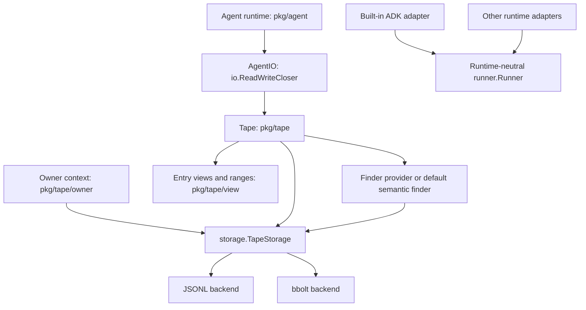

# Stand Tape (Go) Structure

## Design specification

- Stand Tape implements the basic [Tape](https://tape.systems) abstraction in
  `pkg/tape`, exposing agent I/O through `io.ReadWriteCloser`.
- Owner contexts in `pkg/tape/owner` scope storage operations for multiple tenants.
- `storage.TapeStorage` separates Tape from its JSONL and bbolt backends.
- `pkg/agent` provides the built-in ADK runtime and adapter. Other runtimes can
  implement the runtime-neutral `runner.Runner` turn boundary in `pkg/runner`.
- `pkg/tape/finder` integrates search algorithms. `Tape.Find` uses a configured
  finder provider from the storage decorator chain, falling back to the semantic
  finder when no provider is configured.
- `pkg/tape/view` defines entry views and sequence ranges used to select context.

## Architecture diagram

